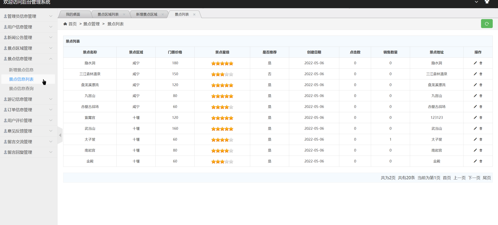

## 基于SSM实现的旅游管理系统

- <b>完整代码获取地址：从戎源码网 ([https://armycodes.com/](https://armycodes.com/))</b>
- <b>技术探讨、资料分享，请加QQ群：692619798</b> 
- <b>作者微信：19941326836  QQ：952045282</b> 
- <b>承接计算机毕业设计、Java毕业设计、Python毕业设计、深度学习、机器学习</b>
- <b>选题+开题报告+任务书+程序定制+安装调试+论文+答辩ppt 一条龙服务</b>
- <b>所有选题地址 ([https://github.com/YuLin-Coder/AllProjectCatalog](https://github.com/YuLin-Coder/AllProjectCatalog)) </b>

## 项目介绍
基于SSM实现的旅游管理系统，该系统主要分为前台和后台两⼤功能模块，共包含两种⻆⾊，分别是：⽤户、管理员。
其功能如下：
1.前台功能
前台⾸⻚、⽤户注册、⽤户登录、新闻公告、景点列表、景点详情、推荐景点、旅游景点、旅游游记、留⾔交流、
景点购票、加⼊购物⻋、加⼊收藏、结算下单、添加评论、个⼈中⼼、修改密码、我的订单、我的收藏、我的游
记、意⻅反馈等功能。
2.后台功能
后台系统登陆、管理员信息管理、⽤户信息管理、新闻公告管理、景点区域管理、景点信息管理、游记信息管理、
订单信息管理、⽤户评价管理、意⻅反馈管理、留⾔交流管理、留⾔回复管理等功能。

## 项目技术
- 编程语言：Java
- 数据库：MySQL
- 前端技术：JSP、jQuery 、H-ui
- 后端技术：Spring、SpringMVC、MyBatis

## 运行环境
- JDK版本：JDK1.8及以上
- 开发工具：IDEA、Ecplise、Myecplise都可以
- 数据库: MySQL5.7及以上

## 运行截图

